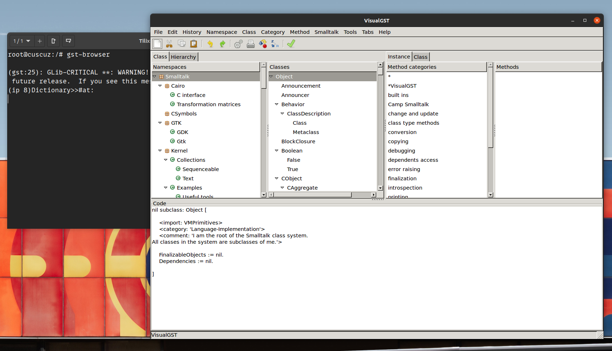

# GNU Smalltalk Dev Environment

As I was exploring Smalltalk via GNU Smalltalk, I encountered issues to install the dev environment locally, so I wrapped it in a container. You can pull the image locally with:

```bash
docker pull tonysm/smalltalk-dev
```

Or you can pull the Dockerfile and build it yourself.

As we need to share the local .X11 to get the GUI to render on our display, the base image doesn't force any command/entrypoint. I'm using the following command to start the container locally:

```bash
docker run --rm -it --net=host -e DISPLAY -v /tmp/.X11-unix tonysm/smalltalk-dev bash
```

This will share your `$DISPLAY` environment variable as well as the `/tmp/.X11-unix` folder with the container. You need to get your xauth cookie line running the following command on your host machine (NOT INSIDE THE CONTAINER):

```bash
xauth list
```

This will give you a couple lines, such as:

```bash
hostname/unix:  MIT-MAGIC-COOKIE-1  abc123
#ffff#abc123#:  MIT-MAGIC-COOKIE-1  abc123
```

Copy that first line and inside the container run:

```bash
xauth add hostname/unix:0  MIT-MAGIC-COOKIE-1  abc123
```

Notice that I had to add a `0` after `hostname/unix:`, it wasn't working for me without it.

Now, you can run the gst-browser and the GUI should pop up on your machine, like so:


